# 1. 数据的存储结构：页


## 1.1 磁盘与内存交互基本单位：页


## 1.2 页结构概述


## 1.3 页的大小

## 1.4 页的上层结构

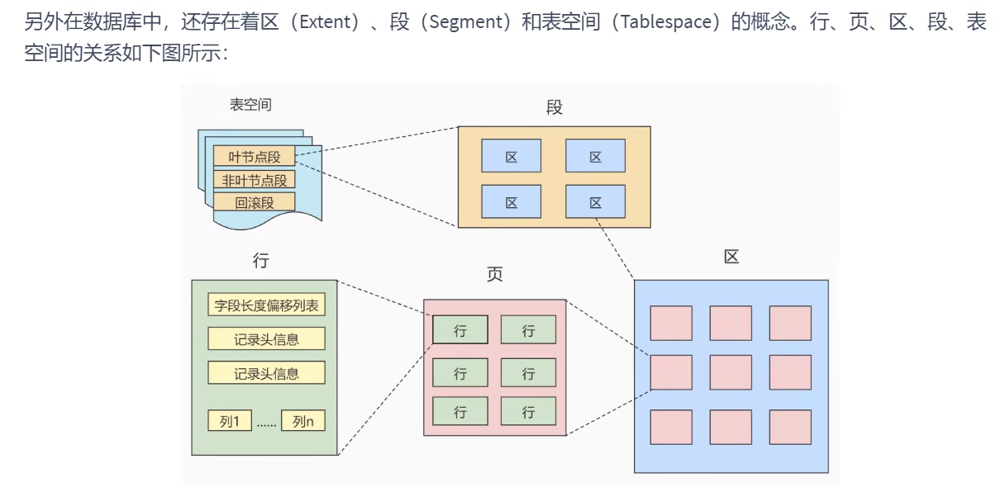


# 2. 页的内部结构


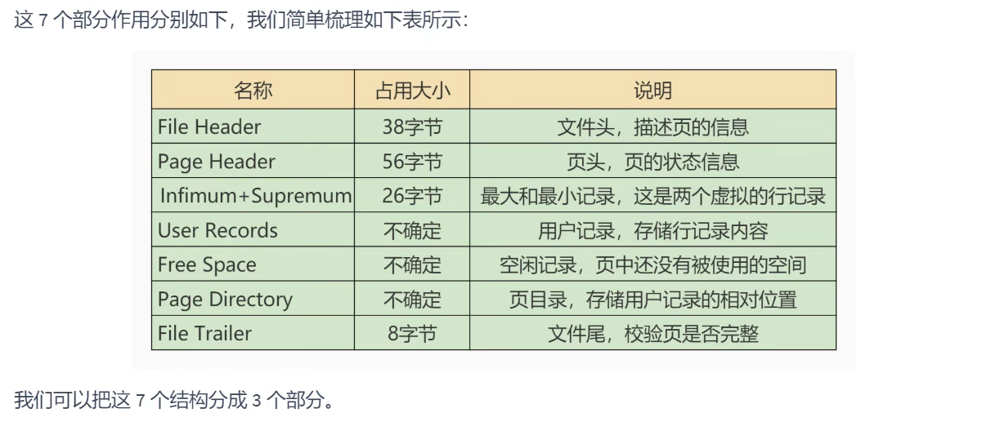

## 2.1 File Header（文件头部）和File Trailer（文件尾部）

### 2.1.1 File Header（文件头部）

**作用：**描述各种页的通用信息。（比如页的编号、其上一页、下一页是谁等）

**大小：**38字节

**构成：**

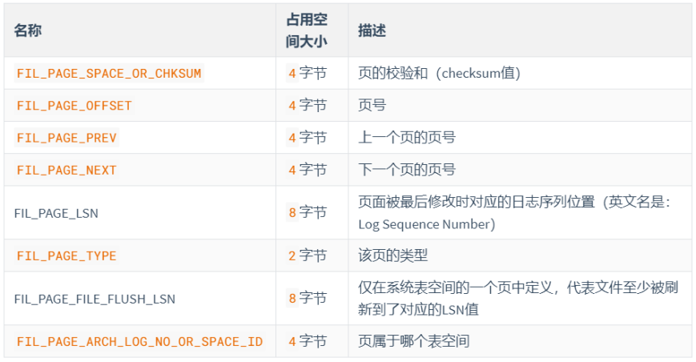

- **<font color=green>FIL_PAGE_OFFSET（4字节）</font>**

  每一个页都有一个单独的页号，就跟你的身份证号码一样，InnoDB通过页号可以唯一定位一个页。

- **<font color=green>FIL_PAGE_TYPE（2字节）</font>**

  这个代表当前页的类型

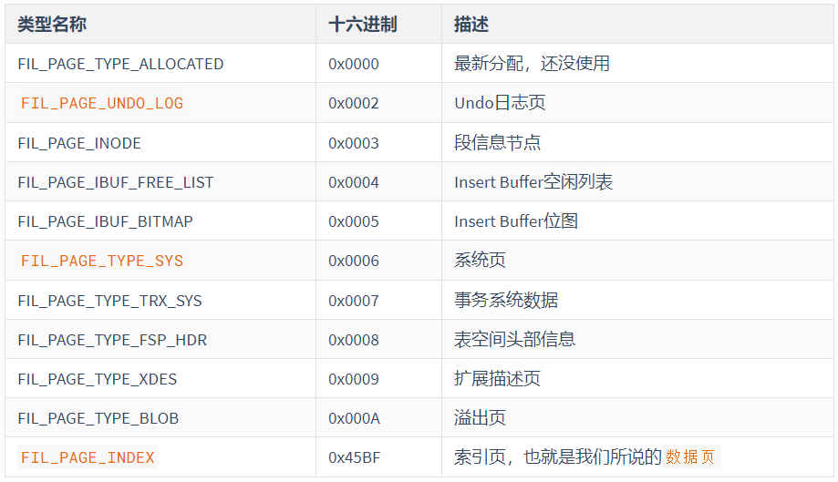

- **<font color=green>FIL_PAGE_PREV（4字节）和FIL_PAGE_NEXT（4字节）</font>**

  InnoDB都是以页为单位存放数据的，如果数据分散到多个不连续的页中存储的话需要把这些页关联起来，FIL_PAGE_PREV和FIL_PAGE_NEXT就分别代表本页的上一个和下一个页的页号。这样通过建立一个双向链表把许许多多的页就都串联起来了，保证这些页之间不需要是物理上的连续，而是逻辑上的连续。


- **<font color=green>FIL_PAGE_SPACE_OR_CHKSUM（4字节）</font>**

  文件头部和文件尾部都有属性：`FIL_PAGE_SPACE_OR_CHKSUM`

  **作用：**
  InnoDB存储引擎以页为单位把数据加载到内存中处理，如果该页中的数据在内存中被修改了，那么在修改后的某个时间需要把数据同步到磁盘中。但是在同步了一半的时候断电了，造成了该页传输的不完整。

  ==为了检测一个页是否完整==（也就是在同步的时候有没有发生只同步一半的尴尬情况），这时==可以通过文件尾的校验和==（checksum 值）==与文件头的校验和做比对==，如果两个值不相等则证明页的传输有问题，需要重新进行传输，否则认为页的传输已经完成。

  **具体的：**

  每当一个页面在内存中修改了，在同步之前就要把它的校验和算出来，因为File Header在页面的前边，所以校验和会被首先同步到磁盘，当完全写完时，校验和也会被写到页的尾部，==如果完全同步成功，则页的首部和尾部的校验和应该是一致的==。如果写了一半儿断电了，那么在File Header中的校验和就代表着已经修改过的页，而在File Trailer中的校验和代表着原先的页，二者不同则意味着同步中间出了错。这里，校验方式就是采用 ==Hash 算法==进行校验。

- **<font color=green>FIL_PAGE_LSN（8字节）</font>**

  页面被最后修改时对应的日志序列位置（英文名是：Log Sequence Number）

### 2.1.2 File Trailer（文件尾部）

- **<font color=green>前4个字节代表页的校验和：</font>**
  这个部分是和File Header中的校验和相对应的。

- **<font color=green>后4个字节代表页面被最后修改时对应的日志序列位置（LSN）：</font>**

  这个部分也是为了校验页的完整性的，如果首部和尾部的LSN值校验不成功的话，就说明同步过程出现了问题。

## 2.2 User Records(用户记录)、最大最小记录、Free Space(空闲空间)

### 2.2.1 Free Space (空闲空间)

我们自己存储的记录会按照指定的==行格式==存储到==User Records==部分。但是在一开始生成页的时候，其实并没有User Records这个部分，==每当我们插入一条记录，都会从Free Space部分，也就是尚未使用的存储空间中申请一个记录大小的空间划分到User Records部分==，当Free Space部分的空间全部被User Records部分替代掉之后，也就意味着这个页使用完了，如果还有新的记录插入的话，就需要去==申请新的页==了。


### 2.2.2 User Records (用户记录)

User Records中的这些记录按照==指定的行格式==一条一条摆在User Records部分，相互之间形成==单链表==。

**用户记录里的一条条数据如何记录？**

这里需要讲讲记录行格式的记录头信息。

### 2.2.3 Infimum + Supremum（最小最大记录）

**记录可以比较大小吗？**

是的，记录可以比大小，对于一条完整的记录来说，比较记录的大小就是==比较主键==的大小。比方说我们插入的4行记录的主键值分别是：1、2、3、4，这也就意味着这4条记录是从小到大依次递增。

InnoDB规定的最小记录与最大记录这两条记录的构造十分简单，都是由5字节大小的记录头信息和8字节大小的一个固定的部分组成的，如图所示：


这两条记录==不是我们自己定义的记录==，所以它们并不存放在页的User Records部分，他们被单独放在一个称为Infimum + Supremum的部分，如图所示：


## 2.3 Page Directory(页目录)、Page Header(页面头部)

### 2.3.1 Page Directory（页目录）

<font color=green>**1.为什么需要页目录？**</font>

在页中，记录是以==单向链表==的形式进行存储的。单向链表的特点就是插入、删除非常方便，但是==检索效率不高==，最差的情况下需要遍历链表上的所有节点才能完成检索。因此在页结构中专门设计了页目录这个模块，==专门给记录做一个目录==，通过==二分查找==法的方式进行检索，提升效率。

需求：根据主键值查找页中的某条记录，如何实现快速查找呢？

```mysql
SELECT * FROM page_demo WHERE c1 = 3;
```

<font color=red>方式1：顺序查找</font>

从Infimum记录（最小记录）开始，沿着链表一直往后找，总有一天会找到（或者找不到），在找的时候还能投机取巧，因为链表中各个记录的值是按照从小到大顺序排列的，所以当链表的某个节点代表的记录的主键值大于你想要查找的主键值时，你就可以停止查找了，因为该节点后边的节点的主键值依次递增。

如果一个页中存储了非常多的记录，这么查找性能很差。

<font color=red>方式2：使用页目录，二分法查找</font>

1. 将所有的记录分成几个组，**这些记录包括最小记录和最大记录，但不包括标记为“已删除”的记**录。

   - 第 1 组，也就是最小记录所在的分组只有 1 个记录；

   - 最后一组，就是最大记录所在的分组，会有 1-8 条记录；

   - 其余的组记录数量在 4-8 条之间。

   这样做的好处是，除了第 1 组（最小记录所在组）以外，其余组的记录数会==尽量平分==。

2. 在每个组中最后一条记录的头信息中会存储该组一共有多少条记录，作为 `n_owned` 字段。

3. <font color=blue>页目录用来存储每组最后一条记录的地址偏移量</font>，这些地址偏移量会按照<font color=blue>先后顺序存储</font>起来，每组的地址偏移量也被称之为<font color=blue>槽（slot）</font>，每个槽相当于指针指向了不同组的最后一个记录。

举例1：


举例2：

现在的page_demo表中正常的记录共有6条，InnoDB会把它们分成两组，第一组中只有一个最小记录，第二组中是剩余的5条记录。如下图：

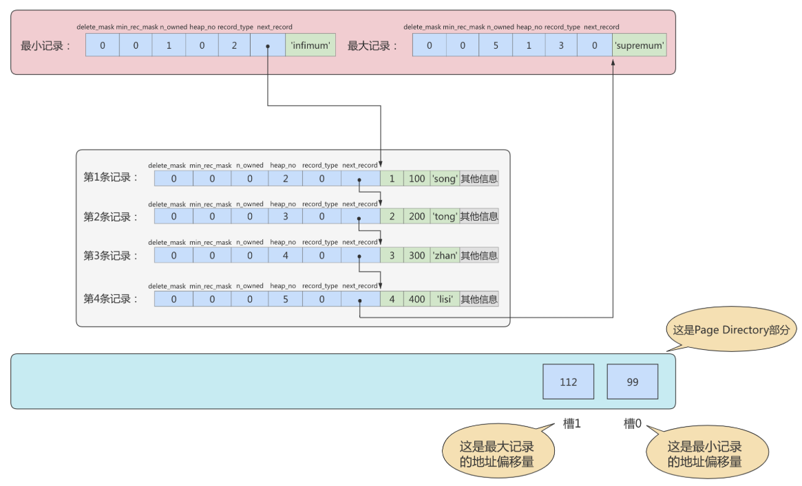

从这个图中我们需要注意这么几点：

- 现在页目录部分中有两个槽，也就意味着我们的记录被分成了两个组，槽1中的值是112，代表最大记录的地址偏移量（就是从页面的0字节开始数，数112个字节）；槽0中的值是99，代表最小记录的地址偏移量。
- 注意最小和最大记录的头信息中的n_owned属性
  - 最小记录的n_owned值为1，这就代表着以最小记录结尾的这个分组中只有1条记录，也就是最小记录本身。
  - 最大记录的n_owned值为5，这就代表着以最大记录结尾的这个分组中只有5条记录，包括最大记录本身还有我们自己插入的4条记录。

用箭头指向的方式替代数字，这样更易于我们理解，修改后如下：


再换个角度看一下：（单纯从逻辑上看一下这些记录和页目录的关系）


<font color=green>**2. 页目录分组的个数如何确定？**</font>

为什么 上面例中 最小记录的n_owned值为1，而最大记录的n_owned值为5呢？

InnoDB规定：**对于最小记录所在的分组只能有1条记录，最大记录所在的分组拥有的记录条数只能在1~8条之间，剩下的分组中记录的条数范围只能在是 4~8 条之间**。

分组是按照下边的步骤进行的：

- 初始情况下一个数据页里只有最小记录和最大记录两条记录，它们分属于两个分组。
- 之后每插入一条记录，都会从页目录中找到主键值比本记录的主键值大并且差值最小的槽，然后把该槽对应的记录的n_owned值加1，表示本组内又添加了一条记录，直到该组中的记录数等于8个。
- 在一个组中的记录数等于8个后再插入一条记录时，会将组中的记录拆分成两个组，一个组中4条记录，另一个5条记录。这个过程会在页目录中新增一个槽来记录这个新增分组中最大的那条记录的偏移量。

<font color=green>**3. 页目录结构下如何快速查找记录？**</font>

现在向page_demo表中添加更多的数据。如下：

```mysql
INSERT INTO page_demo 
VALUES
(5, 500, 'zhou'), 
(6, 600, 'chen'), 
(7, 700, 'deng'), 
(8, 800, 'yang'), 
(9, 900, 'wang'), 
(10, 1000, 'zhao'), 
(11, 1100, 'qian'), 
(12, 1200, 'feng'), 
(13, 1300, 'tang'), 
(14, 1400, 'ding'), 
(15, 1500, 'jing'), 
(16, 1600, 'quan');
```

添加了12条记录，现在页里一共有18条记录了（包括最小和最大记录），这些记录被分成了5个组，如图所示：

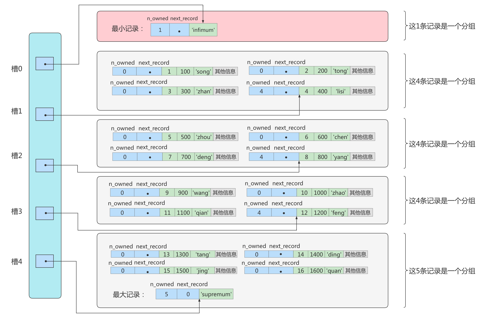

这里只保留了16条记录的记录头信息中的n_owned和next_record属性，省略了各个记录之间的箭头。

现在看怎么从这个页目录中查找记录。因为各个槽代表的记录的主键值都是从小到大排序的，所以我们可以使用二分法来进行快速查找。5个槽的编号分别是：0、1、2、3、4，所以初始情况下最低的槽就是low=0，最高的槽就是high=4。比方说我们想<font color=blue>找主键值为6的记录</font>，过程是这样的：

1. 计算中间槽的位置：(0+4)/2=2，所以查看槽2对应记录的主键值为8，又因为8 > 6，所以设置high=2，low保持不变。
2. 重新计算中间槽的位置：(0+2)/2=1，所以查看槽1对应的主键值为4，又因为4 < 6，所以设置low=1，high保持不变。
3. 因为high - low的值为1，所以确定主键值为6的记录在槽2对应的组中。此刻我们需要找到槽2中主键值最小的那条记录，然后沿着单向链表遍历槽2中的记录。

但是我们前边又说过，==每个槽对应的记录都是该组中主键值最大的记录==，这里槽2对应的记录是主键值为8的记录，怎么定位一个组中最小的记录呢？别忘了各个槽都是挨着的，我们可以很轻易的拿到槽1对应的记录（主键值为4），该条记录的下一条记录就是槽2中主键值最小的记录，该记录的主键值为5。所以我们可以从这条主键值为5的记录出发，遍历槽2中的各条记录，直到找到主键值为6的那条记录即可。

由于一个组中包含的记录条数只能是1~8条，所以遍历一个组中的记录的代价是很小的。

**小结：**

在一个数据页中查找指定主键值的记录的过程分为两步：

1. 通过二分法确定该记录所在的槽，并找到该槽所在分组中主键值最小的那条记录。
2. 通过记录的`next_record`属性遍历该槽所在的组中的各个记录。

### 2.3.2 Page Header（页面头部）

为了能得到一个数据页中存储的记录的状态信息，比如本页中已经存储了多少条记录，第一条记录的地址是什么，页目录中存储了多少个槽等等，特意在页中定义了一个叫Page Header的部分，这个部分占用固定的56个字节，专门存储各种状态信息。


- PAGE_DIRECTION

  假如新插入的一条记录的主键值比上一条记录的主键值大，我们说这条记录的插入方向是右边，反之则是左边。用来表示最后一条记录插入方向的状态就是PAGE_DIRECTION。

- PAGE_N_DIRECTION

  假设连续几次插入新记录的方向都是一致的，InnoDB会把沿着同一个方向插入记录的条数记下来，这个条数就用PAGE_N_DIRECTION这个状态表示。当然，如果最后一条记录的插入方向改变了的话，这个状态的值会被清零重新统计。

## 2.4 从数据页的角度看B+树如何查询

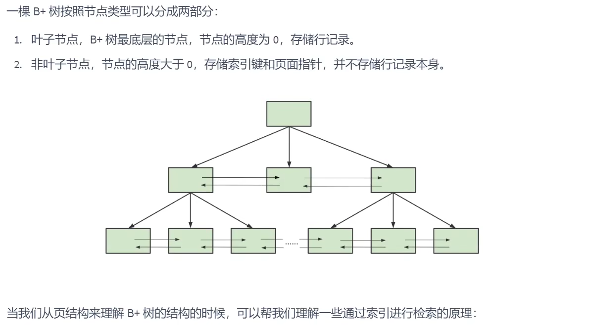


# 3. InnoDB行格式（或记录格式）

## 3.1 指定行格式的语法

在创建或修改表的语句中指定行格式：

```mysql
CREATE TABLE 表名 (列的信息) ROW_FORMAT=行格式名称 # 创建
ALTER TABLE 表名 ROW_FORMAT=行格式名称 # 修改
```

举例：

```mysql
mysql> CREATE TABLE record_test_table (
    ->     col1 VARCHAR(8),
    ->     col2 VARCHAR(8) NOT NULL,
    ->     col3 CHAR(8),
    ->     col4 VARCHAR(8)
    -> ) CHARSET=ascii ROW_FORMAT=COMPACT;
Query OK, 0 rows affected (0.03 sec)
```

向表中插入两条记录：

```mysql
INSERT INTO record_test_table(col1, col2, col3, col4) 
VALUES
('zhangsan', 'lisi', 'wangwu', 'songhk'), 
('tong', 'chen', NULL, NULL);
```

## 3.2 COMPACT行格式

在MySQL 5.1版本中，==默认设置为Compact行格式==。一条完整的记录其实可以被分为记录的额外信息和记录的真实数据两大部分


### 3.2.1 变长字段长度列表

MySQL支持一些变长的数据类型，比如VARCHAR(M)、VARBINARY(M)、TEXT类型，BLOB类型，这些数据类型修饰列称为==变长字段==，变长字段中存储多少字节的数据不是固定的，所以我们在存储真实数据的时候需要顺便把这些数据占用的字节数也存起来。==在Compact行格式中，把所有变长字段的真实数据占用的字节长度都存放在记录的开头部位，从而形成一个变长字段长度列表==。

注意：这里面存储的变长长度和字段==顺序是反过来的==。比如两个varchar字段在表结构的顺序是a(10)，b(15)。那么在变长字段长度列表中存储的长度顺序就是15，10，是反过来的。

以record_test_table表中的第一条记录举例：因为record_test_table表的col1、col2、col4列都是VARCHAR(8)类型的，所以这三个列的值的长度都需要保存在记录开头处，注意record_test_table表中的各个列都使用的是ascii字符集（每个字符只需要1个字节来进行编码，如果是UTF-8，则需要3个字节哦~ ~~）


又因为这些长度值需要按照列的逆序存放，所以最后变长字段长度列表的字节串用十六进制表示的效果就是（各个字节之间实际上没有空格，用空格隔开只是方便理解）：
06 04 08 

把这个字节串组成的变长字段长度列表填入上边的示意图中的效果就是：


### 3.2.2 NULL值列表

Compact行格式会把可以为NULL的列统一管理起来，存在一个标记为NULL值列表中。如果表中没有允许存储 NULL 的列，则 NULL值列表也不存在了。

**为什么定义NULL值列表？**

之所以要存储NULL是因为数据都是需要对齐的，如果==没有标注出来NULL值==的位置，就有可能在查询数据的时候==出现混乱==。如果使==用一个特定的符号==放到相应的数据位表示空置的话，虽然能达到效果，但是这样很==浪费空间==，所以直接就在行数据得头部开辟出一块空间专门用来记录该行数据哪些是非空数据，哪些是空数据，格式如下：

- 二进制位的值为1时，代表该列的值为NULL。

- 二进制位的值为0时，代表该列的值不为NULL。

例如：字段 a、b、c，其中a是主键，在某一行中存储的数依次是 a=1、b=null、c=2。那么Compact行格式中的NULL值列表中存储：01。第一个0表示c不为null，第二个1表示b是null。这里之所以没有a是因为数据库会自动跳过主键，因为主键肯定是非NULL且唯一的，在NULL值列表的数据中就会自动跳过主键。

record_test_table的两条记录的NULL值列表就如下：

第一条记录：


第二条记录：


### 3.2.3 记录头信息（5字节）

**<font color=blue>1. 记录头信息概述</font>**

创建表page_demo

```mysql
mysql> CREATE TABLE page_demo(
    ->     c1 INT,
    ->     c2 INT,
    ->     c3 VARCHAR(10000),
    ->     PRIMARY KEY (c1)
    -> ) CHARSET=ascii ROW_FORMAT=Compact;
Query OK, 0 rows affected (0.03 sec)
```

这个表中记录的行格式示意图：


这些记录头信息中各个属性如下：


简化后的行格式示意图：


插入数据：

```mysql
INSERT INTO page_demo 
VALUES
(1, 100, 'song'), 
(2, 200, 'tong'), 
(3, 300, 'zhan'), 
(4, 400, 'lisi');
```

图示如下：


注：为啥编号是从2开始的，因为默认会有一个最小记录和最大记录

**<font color=blue>2. 头信息中各个属性详细分析</font>**

- **<font color=green>delete_mask</font>**

  这个属性标记着当前记录是否被删除，占用1个二进制位。

  - 值为0：代表记录并没有被删除

  - 值为1：代表记录被删除掉了

  <font color=red>**被删除的记录为什么还在页中存储呢？**</font>

  你以为它删除了，可它还在真实的磁盘上。这些被删除的记录之所以不立即从磁盘上移除，是因为移除它们之后其他的记录在磁盘上需要==重新排列，导致性能消耗==。所以只是打一个删除标记而已，所有被删除掉的记录都会组成一个所谓的==垃圾链表==，在这个链表中的记录占用的空间称之为==可重用空间==，之后如果有新记录插入到表中的话，可能把这些被删除的记录占用的存储空间覆盖掉

- **<font color=green>min_rec_mask</font>**

  B+树的每层非叶子节点中的最小记录都会添加该标记，min_rec_mask值为1。

  我们自己插入的四条记录的min_rec_mask值都是0，意味着它们都不是B+树的非叶子节点中的最小记录。

- **<font color=green>record_type</font>**

  这个属性表示当前记录的类型，一共有4种类型的记录：

  - 0：表示普通记录

  - 1：表示B+树非叶节点记录
  -  2：表示最小记录

  -  3：表示最大记录

  从图中我们也可以看出来，我们自己插入的记录就是普通记录，它们的record_type值都是0，而最小记录和最大记录的record_type值分别为2和3。至于record_type为1的情况，我们在索引的数据结构章节讲过。

- **<font color=green>heap_no</font>**

  这个属性表示当前记录在本页中的位置。

  从图中可以看出来，我们插入的4条记录在本页中的位置分别是：2、3、4、5。

  <font color=red>怎么不见heap_no值为0和1的记录呢？</font>

  MySQL会自动给每个页里加了两个记录，由于这两个记录并不是我们自己插入的，所以有时候也称为==伪记录==或者==虚拟记录==。这两个伪记录一个代表==最小记录==，一个代表==最大记录==。最小记录和最大记录的heap_no值分别是0和1，也就是说它们的位置最靠前。

- **<font color=green>n_owned</font>**

  页目录中每个组中最后一条记录的头信息中会存储该组一共有多少条记录，作为 n_owned 字段。 详情见page directory。

- **<font color=green>next_record</font>**

  记录头信息里该属性非常重要，它表示从当前记录的真实数据到下一条记录的真实数据的==地址偏移量==。

  比如：第一条记录的next_record值为32，意味着从第一条记录的真实数据的地址处向后找32个字节便是下一条记录的真实数据。

  注意，**下一条记录指得并不是按照我们插入顺序的下一条记录，而是按照主键值由小到大的顺序的下一条记录**。而且规定Infimum记录（也就是最小记录）的下一条记录就是本页中主键值最小的用户记录，而本页中主键值最大的用户记录的下一条记录就是 Supremum记录（也就是最大记录）。下图用箭头代替偏移量表示next_record。

  

**<font color=blue>3. 演示删除和添加操作</font>**

==删除操作：==

从表中删除掉一条记录，这个链表也是会跟着变化：

```mysql
mysql> DELETE FROM page_demo WHERE c1 = 2;
Query OK, 1 row affected (0.02 sec)
```

删掉第2条记录后的示意图就是：


从图中可以看出来，删除第2条记录前后主要发生了这些变化：
- 第2条记录并没有从存储空间中移除，而是把该条记录的`delete_mask`值设置为1。
- 第2条记录的`next_record`值变为了0，意味着该记录没有下一条记录了。
- 第1条记录的`next_record`指向了第3条记录。
- 最大记录的`n_owned`值从 5 变成了 4 。

<font color=red>所以，不论我们怎么对页中的记录做增删改操作，InnoDB始终会维护一条记录的单链表，链表中的各个节点是按照主键值由小到大的顺序连接起来的</font>。

==添加操作：==

主键值为2的记录被我们删掉了，但是存储空间却没有回收，如果我们再次把这条记录插入到表中，会发生什么事呢？

```mysql
mysql> INSERT INTO page_demo VALUES(2, 200, 'tong');
Query OK, 1 row affected (0.00 sec)
```

我们看一下记录的存储情况：

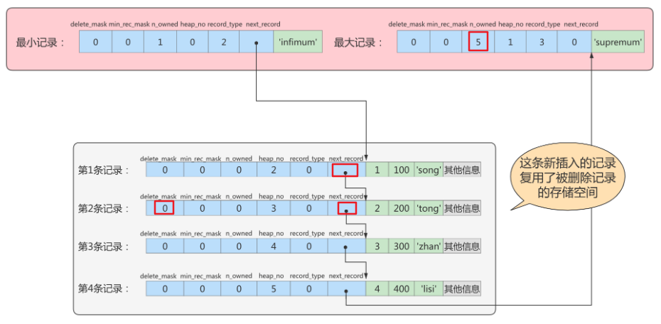

**<font color=blue>直接复用了原来被删除记录的存储空间</font>。**

**说明：**当数据页中存在多条被删除掉的记录时，这些记录的`next_record`属性将会把这些被删除掉的记录组成一个垃圾链表，以备之后重用这部分存储空间。

### 3.2.4 记录真实的数据

记录的真实数据除了我们自己定义的列的数据以外，还会有三个隐藏列：


实际上这几个列的真正名称其实是：DB_ROW_ID、DB_TRX_ID、DB_ROLL_PTR。

- ==一个表没有手动定义主键，则会选取一个Unique键作为主键，如果连Unique键都没有定义的话，则会为表默认添加一个名为row_id的隐藏列作为主键==。所以row_id是在没有自定义主键以及Unique键的情况下才会存在的。
- 事务ID和回滚指针在后面的《第14章_MySQL事务日志》章节中讲解。

举例：分析Compact行记录的内部结构：

```mysql
CREATE TABLE mytest(
    col1 VARCHAR(10),
    col2 VARCHAR(10),
    col3 CHAR(10),
    col4 VARCHAR(10)
)ENGINE=INNODB CHARSET=LATIN1 ROW_FORMAT=COMPACT;


INSERT INTO mytest
VALUES('a','bb','bb','ccc');

INSERT INTO mytest
VALUES('d','ee','ee','fff');

INSERT INTO mytest
VALUES('d',NULL,NULL,'fff');
```

在Windows操作系统下，可以选择通过程序UltraEdit打开表空间文件mytest.ibd这个二进制文件。内容如下：

```mysql
------------------------------------------------------------------------------------------
0000c070 73 75 70 72 65 6d 75 6d 03 02 01 00 00 00 10 00|supremum........|
0000c080 2c 00 00 00 2b 68 00 00 00 00 00 06 05 80 00 00|,...+h..........|
0000c090 00 32 01 10 61 62 62 62 62 20 20 20 20 20 20 20|.2..abbbb|
0000c0a0 20 63 63 63 03 02 01 00 00 00 18 00 2b 00 00 00|ccc........+...|
0000c0b0 2b 68 01 00 00 00 00 06 06 80 00 00 00 32 01 10|+h...........2..|
0000c0c0 64 65 65 65 65 20 20 20 20 20 20 20 20 66 66 66|deeeefff|
0000c0d0 03 01 06 00 00 20 ff 98 00 00 00 2b 68 02 00 00|..........+h...|
0000c0e0 00 00 06 07 80 00 00 00 32 01 10 64 66 66 66 00|........2..dfff.|
------------------------------------------------------------------------------------------
```


该行记录从0000c078开始，参考下面的，相信大家会有更好的理解：

```mysql
---------------------------------------------------------------------
03 02 01                     /*变长字段长度列表，逆序*/
00                              /*NULL标志位，第一行没有NULL值*/
00 00 10 00 2c            /*Record Header，固定5字节长度*/
00 00 00 2b 68 00       /*RowID InnoDB自动创建，6字节*/
00 00 00 00 06 05       /*TransactionID*/
80 00 00 00 32 01 10   /*Roll Pointer*/
61                               /*列1数据'a'*/
62 62                          /*列2数据'bb'*/
62 62 20 20 20 20 20 20 20 20/*列3数据'bb'*/
63 63 63                     /*列4数据'ccc'*/
---------------------------------------------------------------------
```

注意1：InnoDB每行有隐藏列TransactionID和Roll Pointer。:
注意2：固定长度CHAR字段在未能完全占用其长度空间时，会用0x20 （也就是空格）来进行填充。

接着再来分析下Record Header的最后两个字节，这两个字节代表next_recorder，0x2c代表下一个记录的偏移量，即当前记录的位置加上偏移量0x2c就是下条记录的起始位置。

第二行将不做整理，除了RowID不同外，它和第一行大同小异，现在来分析有NULL值的第三行：

```mysql
---------------------------------------------------------------------
03 01                               /*变长字段长度列表，逆序*/
06                                   /*NULL标志位，第三行有NULL值*/
00 00 20 ff 98                  /*Record Header*/
00 00 00 2b 68 02           /*RowID*/
00 00 00 00 06 07           /*TransactionID*/
80 00 00 00 32 01 10       /*Roll Pointer*/
64                                   /*列1数据'd'*/
66 66 66                         /*列4数据'fff'*/
---------------------------------------------------------------------
```

第三行有NULL值，因此NULL标志位不再是00而是06，转换成二进制为00000110，为1的值代表第2列和第3列的数据为NULL。在其后存储列数据的部分，用户会发现没有存储NULL列，而只存储了第1列和第4列非NULL的值。

因此这个例子很好地说明了：==不管是CHAR类型还是VARCHAR类型，在compact格式下NULL值都不占用任何存储空间==

## 3.3 Dynamic和Compressed行格式

### 3.3.1 行溢出

**<font color=red>InnoDB存储引擎可以将一条记录中的某些数据存储在真正的数据页面之外。</font>**

很多DBA喜欢MySQL数据库提供的VARCHAR(M)类型，认为可以存放65535字节。这是真的吗？如果我们使用 ascii字符集的话，一个字符就代表一个字节，我们看看VARCHAR(65535)是否可用。

```mysql
CREATE  TABLE  varchar_size_demo(
 c  VARCHAR(65535)
 )  CHARSET=ascii  ROW_FORMAT=Compact;
# 结果如下：
ERROR 1118 (42000): Row size too large. The maximum row size for the used table type, not counting BLOBs, is 65535. This includes storage overhead, check the manual. You have  to  change  some  columns  to  TEXT or  BLOBs
```

报错信息表达的意思是：MySQL对一条记录占用的最大存储空间是有限制的，==除BLOB或者TEXT类型的列之外， 其他所有的列==（不包括隐藏列和记录头信息）==占用的字节长度加起来不能超过65535个字节==

这个65535个字节除了列本身的数据之外，还包括一些其他的数据，以Compact行格式为例，比如说我们为了存储一个VARCHAR(M)类型的列，除了真实数据占有空间以外，还需要记录的额外信息。

如果该VARCHAR类型的列没有NOT NULL属性，那==最多只能存储65532个字节的数据==，因为变长字段的长度占用 2个字节，NULL值标识需要占用1个字节。

```mysql
CREATE  TABLE  varchar_size_demo(
    c  VARCHAR(65532)
)  CHARSET=ascii  ROW_FORMAT=Compact; # 可以创建成功
```

如果有not null属性，那么就不需要NULL值标识，也就可以多存储一个字节，即65533个字节

```mysql
CREATE  TABLE  varchar_size_demo( 
  c  VARCHAR(65533)  not  null
)  CHARSET=ascii  ROW_FORMAT=Compact; # 可以创建成功
```

通过上面的案例，我们可以知道一个页的大小一般是16KB，也就是16384字节，而一个VARCHAR(M)类型的列就最多可以存储65533个字节，这样就可能出现一个页存放不了一条记录，这种现象称为==行溢出==

在Compact和Reduntant行格式中，对于占用存储空间非常大的列，在记录的真实数据处只会存储该列的一部分数据，把剩余的数据分散存储在几个其他的页中进行==分页存储==，然后记录的真实数据处用20个字节存储指向这些页的地址（当然这20个字节中还包括这些分散在其他页面中的数据的占用的字节数），从而可以找到剩余数据所在的页。

这称为页的扩展，举例如下：


### 3.3.2 Dynamic和Compressed行格式

在MySQL 8.0中，==默认行格式就是Dynamic==，Dynamic、Compressed行格式和Compact行格式挺像，只不过在处理行溢出数据时有分歧：

- Compressed和Dynamic两种记录格式对于存放在BLOB中的数据采用了完全的行溢出的方式。如图，在数据页中只存放20个字节的指针（溢出页的地址），实际的数据都存放在Off Page（溢出页）中。
- Compact和Redundant两种格式会在记录的真实数据处存储一部分数据（存放768个前缀字节）。

Compressed行记录格式的另一个功能就是，存储在其中的行数据会以zlib的算法进行压缩，因此对于BLOB、TEXT、VARCHAR这类大长度类型的数据能够进行非常有效的存储。


## 3.4 Redundant行格式

Redundant是MySQL 5.0版本之前InnoDB的行记录存储方式，MySQL 5.0支持Redundant是为了兼容之前版本的页格式。

现在我们把表record_test_table的行格式修改为Redundant：

```mysql
ALTER TABLE record_test_table ROW_FORMAT=Redundant;
Query OK, 0 rows affected (0.05 sec)
Records: 0  Duplicates: 0  Warnings: 0
```


从上图可以看到，不同于Compact行记录格式，Redundant行格式的首部是一个字段长度偏移列表，同样是按照列的顺序==逆序放置==的。

下边我们从各个方面看一下Redundant行格式有什么不同的地方。

### 3.4.1 字段长度偏移列表

注意Compact行格式的开头是变长字段长度列表，而Redundant行格式的开头是字段长度偏移列表，与变长字段长度列表有两处不同：

- 少了“变长”两个字：Redundant行格式会把该条记录中所有列（包括隐藏列）的长度信息都按照逆序存储到==字段长度偏移列表==
- 多了“偏移”两个字：这意味着计算列值长度的方式不像Compact行格式那么直观，它是采用两个相邻数值的差值来计算==各个列值==的长度

举例：比如第一条记录的字段长度偏移列表就是：
2B 25 1F 1B 13 0C 06

因为它是逆序排放的，所以按照列的顺序排列就是：
06 0C 13 17 1A 24 25

按照两个相邻数值的差值来计算各个列值的长度的意思就是：

- 第一列(row_id)的长度就是 0x06个字节，也就是6个字节。
- 第二列(transaction_id)的长度就是 (0x0C - 0x06)个字节，也就是6个字节。
- 第三列(roll_pointer)的长度就是 (0x13 - 0x0C)个字节，也就是7个字节。
- 第四列(col1)的长度就是 (0x1B - 0x13)个字节，也就是8个字节。
- 第五列(col2)的长度就是 (0x1F - 0x1B)个字节，也就是4个字节。
- 第六列(col3)的长度就是 (0x25 - 0x1F)个字节，也就是6个字节。
- 第七列(col4)的长度就是 (0x2B - 0x25)个字节，也就是6个字节。

### 3.4.2 记录头信息（record header）

不同于Compact行格式，Redundant行格式中的记录头信息固定占用6个字节（48位），每位的含义见下表


与Compact行格式的记录头信息对比来看，有两处不同：（下面的解释，了解即可）

- Redundant行格式多了`n_field`和`1byte_offs_flag`这两个属性。
- Redundant行格式没有record_type这个属性。

其中，n_fields：代表一行中列的数量，占用10位，这也很好地解释了为什么MySQL一个行支持最多的列为1023。另一个值为1byte_offs_flags，该值定义了偏移列表占用1个字节还是2个字节。当它的值为1时，表明使用1个字节存储。当它的值为0时，表明使用2个字节存储。

**<font color=blue>1byte_offs_flag的值是怎么选择的 ?</font>**

我们前边说过每个列对应的偏移量可以占用1个字节或者2个字节来存储，那到底什么时候用1个字节，什么时候用2个字节呢？其实是根据该条Redundant行格式记录的真实数据占用的总大小来判断的：

- 当记录的真实数据占用的字节数值不大于127（十六进制0x7F，二进制01111111）时，每个列对应的偏移量占用1个字节。
- 当记录的真实数据占用的字节数大于127，但不大于32767（十六进制0x7FFF，二进制0111111111111111）时，每个列对应的偏移量占用2个字节。

- 有没有记录的真实数据大于32767的情况呢？有，不过此时的记录已经存放到了溢出页中，在本页中只保留前768个字节和20个字节的溢出页面地址。因为字段长度偏移列表处只需要记录每个列在本页面中的偏移就好了，所以每个列使用2个字节来存储偏移量就够了。

  大家可以看出来，Redundant行格式还是比较简单粗暴的，直接使用整个记录的真实数据长度来决定使用1个字节还是2个字节存储列对应的偏移量。只要整条记录的真实数据占用的存储空间大小大于127，即使第一个列的值占用存储空间小于127，那对不起，也需要使用2个字节来表示该列对应的偏移量。简单粗暴，就是这么简单粗暴（所以这种行格式有些过时了）。

  为了在解析记录时知道每个列的偏移量是使用1个字节还是2个字节表示的，Redundant行格式特意在`记录头信息`里放置了一个称之为1byte_offs_flag的属性：

**Redundant行格式中NULL值的处理**

因为Redundant行格式并没有NULL值列表，所以Redundant行格式在字段长度偏移列表中的各个列对应的偏移量处做了一些特殊处理 —— 将列对应的偏移量值的第一个比特位作为是否为NULL的依据，该比特位也可以被称之为NULL比特位。也就是说在解析一条记录的某个列时，首先看一下该列对应的偏移量的NULL比特位是不是为1。如果为1，那么该列的值就是NULL，否则不是NULL。

这也就解释了上边介绍为什么只要记录的真实数据大于127（十六进制0x7F，二进制01111111）时，就采用2个字节来表示一个列对应的偏移量，主要是第一个比特位是所谓的NULL比特位，用来标记该列的值是否为NULL。

但是还有一点要注意，对于值为NULL的列来说，该列的类型是否为定长类型决定了NULL值的实际存储方式，我们接下来分析一下record_test_table表的第二条记录，它对应的字段长度偏移列表如下：
 A4 A4 1A 17 13 0C 06
按照列的顺序排放就是：
06 0C 13 17 1A A4 A4
我们分情况看一下：

- 如果存储NULL值的字段是定长类型的，比方说`CHAR(M)`数据类型的，则NULL值也将占用记录的真实数据部分，并把该字段对应的数据使用0x00字节填充。
  如图第二条记录的c3列的值是NULL，而c3列的类型是`CHAR(10)`，占用记录的真实数据部分10字节，所以我们看到在Redundant行格式中使用0x00000000000000000000来表示NULL值。
  另外，c3列对应的偏移量为0xA4，它对应的二进制实际是：10100100，可以看到最高位为1，意味着该列的值是NULL。将最高位去掉后的值变成了0100100，对应的十进制值为36，而c2列对应的偏移量为0x1A，也就是十进制的26。36 - 26 = 10，也就是说最终c3列占用的存储空间为10个字节。
- 如果该存储NULL值的字段是变长数据类型的，则不在记录的真实数据处占用任何存储空间。
  比如record_test_table表的c4列是VARCHAR(10)类型的，VARCHAR(10)是一个变长数据类型，c4列对应的偏移量为0xA4，与c3列对应的偏移量相同，这也就意味着它的值也为NULL，将0xA4的最高位去掉后对应的十进制值也是36，36 - 36 = 0，也就意味着c4列本身不占用任何记录的实际数据处的空间。

除了以上的几点之外，Redundant行格式和Compact行格式还是大致相同的

==总结：Redundant行格式和Compact行格式的差异==

1. Redundant 没有了NULL值列表

2. Redundant 行格式的记录头信息

   - 多了`n_field`和`1byte_offs_flag`这两个属性

   - 没有record_type这个属性。

# 4. 区、段与碎片区

## 4.1 为什么要有区？


## 4.2 为什么要有段？


## 4.3 为什么要有碎片区？


### 4.4 区的分类


# 5. 表空间


## 5.1 独立表空间

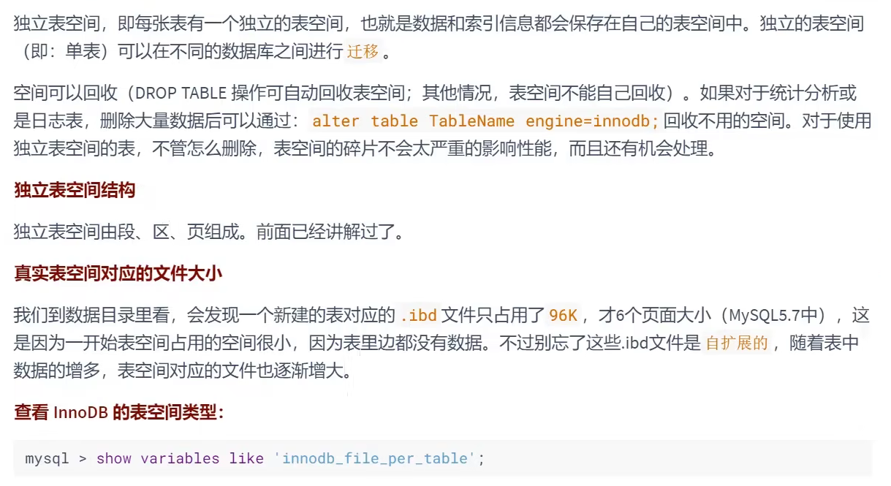


你能看到inndb_file_per_table=ON，这意味着每张表都会单独保存一个`.ibd`文件

## 5.2 系统表空间

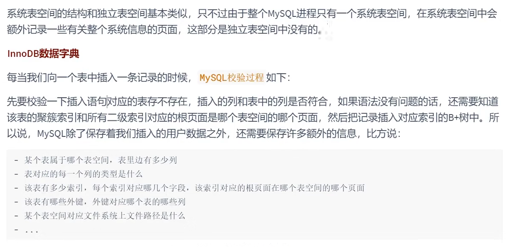

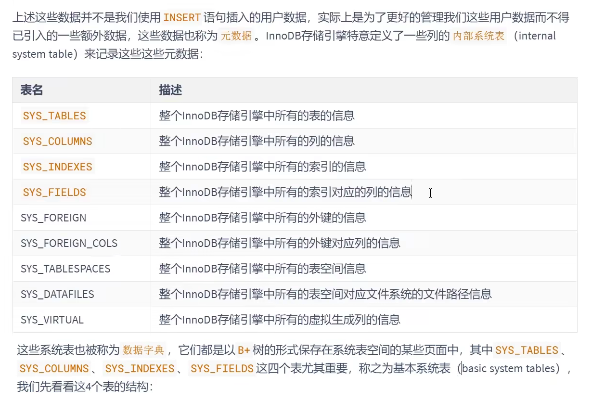


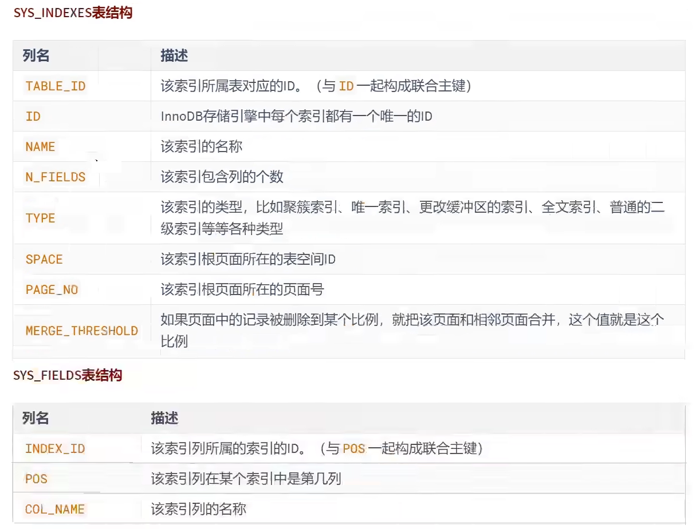

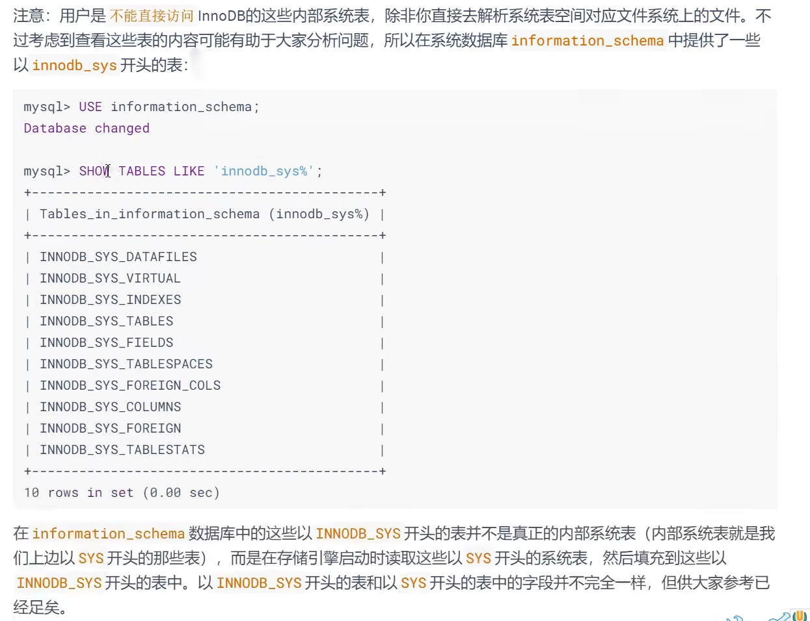

# 附录：数据页加载的三种方式


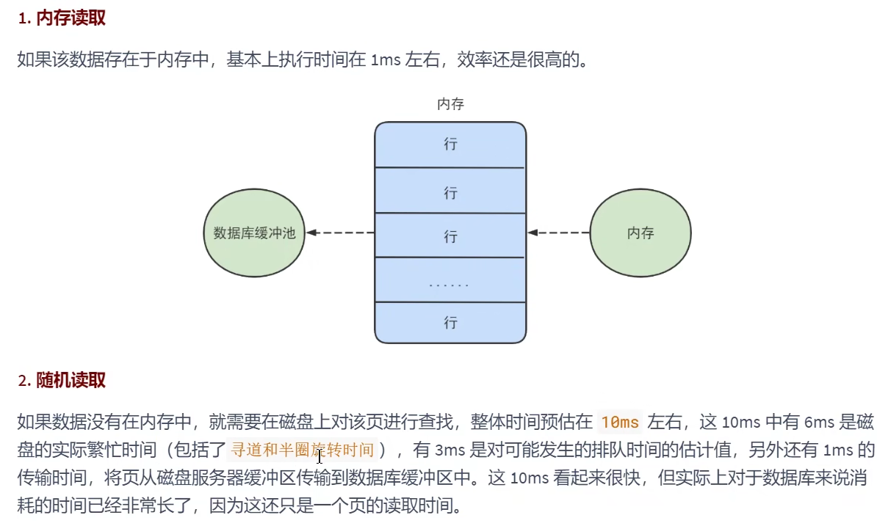

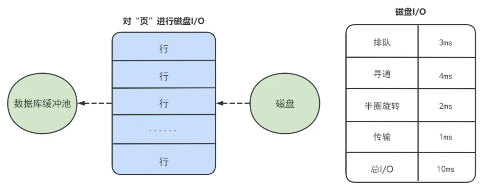

